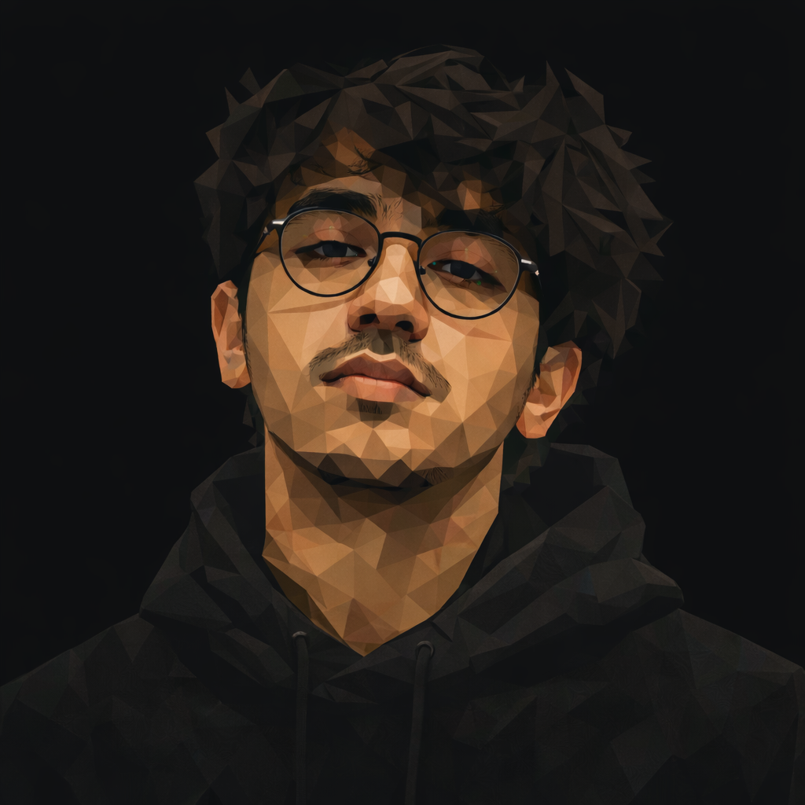

```markdown
<p align="center">
  
</p>

<p align="center">
    <samp>theme: dark-red / neon-green</samp> |
    <samp>shell: zsh</samp> |
    <samp>status: <span style="color: #00FF9C">ONLINE</span></samp>
</p>

<p align="center">
  
</p>

---

<p align="center">
  
</p>

<pre align="center">
<code style="color: #ff003c;">
 ██████╗ ██████╗ ███████╗████████╗██╗███╗   ██╗██╗██╗  ██╗
██╔═══██╗██╔══██╗██╔════╝╚══██╔══╝██║████╗  ██║██║╚██╗██╔╝
██║   ██║██████╔╝███████╗   ██║   ██║██╔██╗ ██║██║ ╚███╔╝ 
██║   ██║██╔══██╗╚════██║   ██║   ██║██║╚██╗██║██║ ██╔██╗ 
╚██████╔╝██████╔╝███████║   ██║   ██║██║ ╚████║██║██╔╝ ██╗
 ╚═════╝ ╚═════╝ ╚══════╝   ╚═╝   ╚═╝╚═╝  ╚═══╝╚═╝╚═╝  ╚═╝
</code>
</pre>

<p align="center">
<code>PIYUSH :: obstinix</code>
</p>

---

### `> BOOT_SEQUENCE.log`
```bash
$ ssh obstinix@github
[ OK ] Loading profile
[ OK ] Mounting skills
[ OK ] Initializing chess engine
[ OK ] Ready...

```

### `> IDENTITY_MATRIX.sys`

```text
+--------------------------------------------------+
| USER        : obstinix                           |
| NAME        : Piyush                             |
| ROLE        : DevOps / Full Stack Developer      |
| ENV         : Linux                              |
| STRATEGY    : Chess (Calculation > Intuition)    |
| STATUS      : BUILDING                           |
+--------------------------------------------------+

```

### `> SKILL_TREE.map`

```text
/home/obstinix/skills
├── languages
│   ├── python
│   ├── c_cpp
│   ├── java
│   ├── go
│   └── javascript
├── frontend
│   ├── react_native
│   ├── tailwind_css
│   └── html5
├── backend
│   ├── node_js
│   ├── express
│   └── redis
└── devops
    ├── docker_containers
    ├── kubernetes
    ├── aws_cloud
    └── linux_kernel

```

### `> SYSTEM_METRICS.stat`

<p align="center">


</p>

### `> CHESS_ENGINE.core`

<p align="left">
<a href="https://www.chess.com/member/obstinixx">

</a>
</p>

### `> NETWORK_PORTS.open`

```c
// CORE_LOOP.c
while (alive) {
    think_ahead();
    build_systems();
    remove_complexity();
    learn();
}

```

<p align="left">
<a href="mailto:obstinix@gmail.com">

</a>
<a href="https://www.google.com/search?q=https://linkedin.com/in/piyushpandey23">

</a>
<a href="https://www.google.com/search?q=https://leetcode.com/obstinix">

</a>
<a href="https://www.google.com/search?q=https://codeforces.com/profile/obstinix">

</a>
</p>

```text
FINAL_SIGNAL.txt
NO DISTRACTIONS.
NO SHORTCUTS.
THINK 5 MOVES AHEAD.

```

<br />
<p align="left">
<code style="color: #00FF9C;">obstinix@system:~$</code>

</p>

```

```
