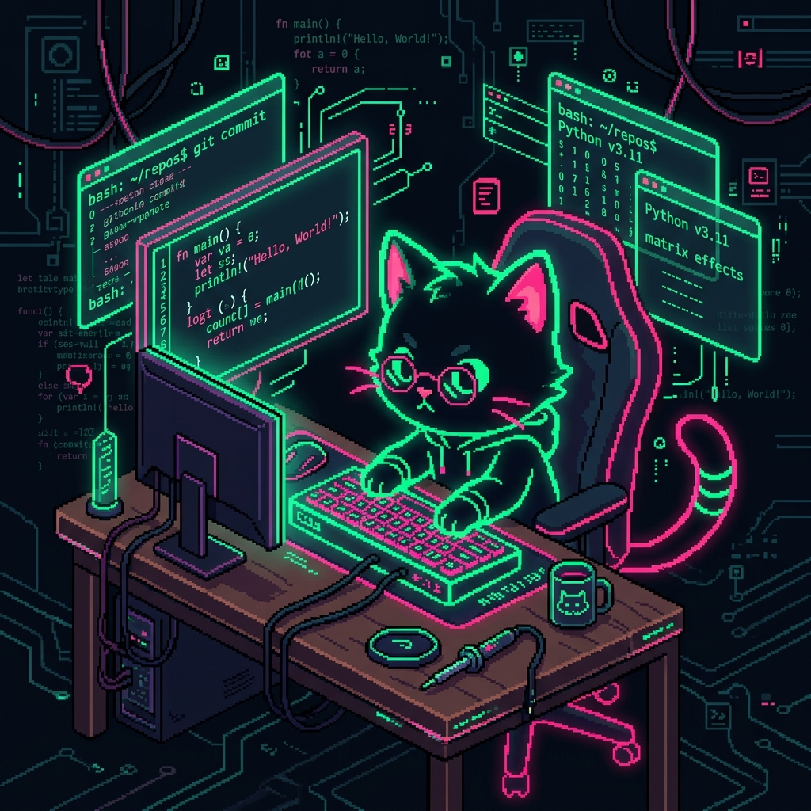
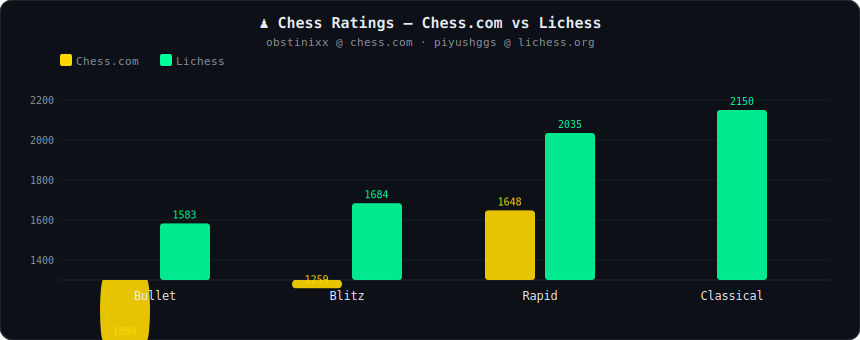

<!-- WAVE HEADER -->
<div align="center">
  
</div>

<!-- TYPING HEADER -->
<div align="center">
  
</div>

<br/>

<div align="center">
  
</div>

<br/>

<div align="center">
  
  &nbsp;
  <a href="https://github.com/obstinix?tab=followers">
    
  </a>
  &nbsp;
  <a href="https://github.com/obstinix?tab=stars">
    
  </a>
</div>

<br/>

<h3><code>> IDENTITY_MATRIX.sys</code></h3>

```
╔══════════════════════════════════════════════════════════════╗
║  USER        : obstinix                                      ║
║  NAME        : Piyush                                        ║
║  FOCUS       : Full-Stack Web · DevOps · Cloud-Native        ║
║  LEARNING    : Kubernetes · CI/CD · Scalable Systems         ║
║  COLLAB      : Open Source · SaaS · Dev-Tools                ║
║  CHESS       : 2035 Rapid (Lichess) · 1607 Rapid (Chess.com) ║
║  FUN_FACT    : Tactical attacker ♟  · Rated on 2 platforms   ║
║  LOCATION    : India 🇮🇳                                      ║
║  STATUS      : [ ██████████ ] Always Shipping                ║
╚══════════════════════════════════════════════════════════════╝
```

<br/>

<h3><code>> TROPHY_CABINET.exe</code></h3>

<div align="center">
  
</div>

<br/>

<h3><code>> ACHIEVEMENTS.dat</code></h3>

<div align="center">
  
  
  
  
</div>

<br/>

<h3><code>> SKILL_TREE.map — Tech Stack</code></h3>

**Languages**
<div align="center">
  
</div>
<br/>

**Frontend & Mobile**
<div align="center">
  
</div>
<br/>

**Backend & Databases**
<div align="center">
  
</div>
<br/>

**Cloud, DevOps & Tools**
<div align="center">
  
</div>
<br/>

**AI / ML & Creative**
<div align="center">
  
</div>

<br/>

<h3><code>> ANALYTICS_DASHBOARD.exe</code></h3>

<div align="center">
  
  &nbsp;
  
  &nbsp;
  
  &nbsp;
  
</div>

<br/>

<h3><code>> GITHUB_STATS.log</code></h3>

<div align="center">
  
  &nbsp;
  
</div>

<br/>

<div align="center">
  
</div>

<br/>

<h3><code>> PROFILE_SUMMARY.cards — from local repo SVGs</code></h3>

<div align="center">
  
</div>

<br/>

<div align="center">
  
  &nbsp;
  
  &nbsp;
  
  &nbsp;
  
</div>

<br/>

<h3><code>> CONTRIBUTION_GRAPH.log</code></h3>

<div align="center">
  
</div>

<br/>

<h3><code>> LEETCODE_STATS.log</code></h3>

<div align="center">
  
</div>

<div align="center">
  
  &nbsp;
  
  &nbsp;
  
</div>

<br/>

<h3><code>> CHESS_ENGINE.core — Rating Graph ♟</code></h3>

<div align="center">
  
</div>

<div align="center">
  <a href="https://www.chess.com/member/obstinixx">
    
  </a>
  &nbsp;
  <a href="https://lichess.org/@/piyushggs">
    
  </a>
  &nbsp;
  
</div>

<br/>

<h3><code>> SNAKE_GAME.exe — Eating contributions 🐍</code></h3>

<div align="center">
  <picture>
    <source media="(prefers-color-scheme: dark)" srcset="https://raw.githubusercontent.com/obstinix/obstinix/output/github-contribution-grid-snake-dark.svg"/>
    <source media="(prefers-color-scheme: light)" srcset="https://raw.githubusercontent.com/obstinix/obstinix/output/github-contribution-grid-snake.svg"/>
    
  </picture>
</div>

<br/>

<h3><code>> PACMAN_GAME.exe — Nom nom 👾</code></h3>

<div align="center">
  <picture>
    <source media="(prefers-color-scheme: dark)" srcset="https://raw.githubusercontent.com/obstinix/obstinix/output/pacman-contribution-grid-snake-dark.svg"/>
    <source media="(prefers-color-scheme: light)" srcset="https://raw.githubusercontent.com/obstinix/obstinix/output/pacman-contribution-grid-snake.svg"/>
    
  </picture>
</div>

<br/>

<h3><code>> NETWORK_PORTS.open — Connect</code></h3>

<div align="left">

**Socials**

<a href="mailto:obstinix@gmail.com"></a>
<a href="https://linkedin.com/in/piyushpandey23"></a>
<a href="https://twitter.com/obstinix"></a>
<a href="https://instagram.com/ig_obstinate"></a>
<a href="https://medium.com/@obstinix"></a>
<a href="https://linktr.ee/piyushxpandey"></a>

<br/><br/>

**Competitive & Dev**

<a href="https://leetcode.com/obstinix"></a>
<a href="https://codeforces.com/profile/obstinix"></a>
<a href="https://www.codechef.com/users/obstinix"></a>
<a href="https://www.hackerrank.com/obstinix"></a>
<a href="https://auth.geeksforgeeks.org/user/obstinix"></a>
<a href="https://kaggle.com/obstinix"></a>
<a href="https://codesandbox.com/obstinix"></a>

</div>

<br/>

<div align="center">
  
</div>

<div align="center">
  
</div>
